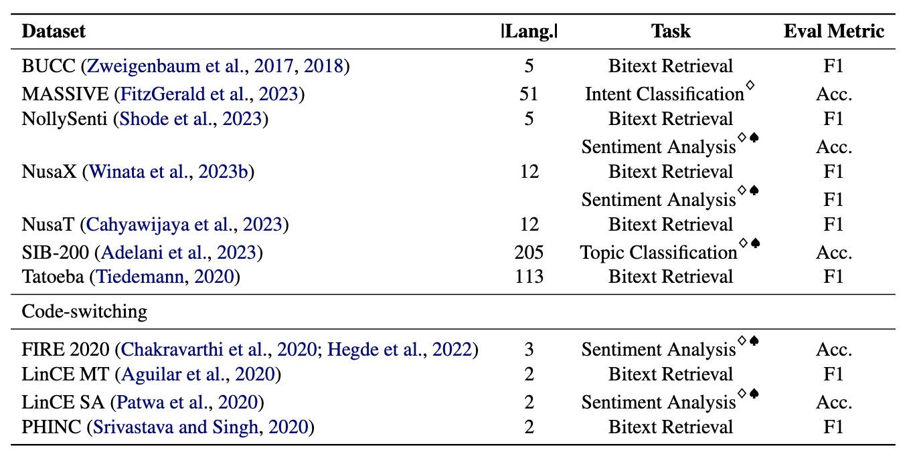
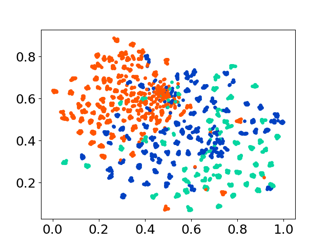
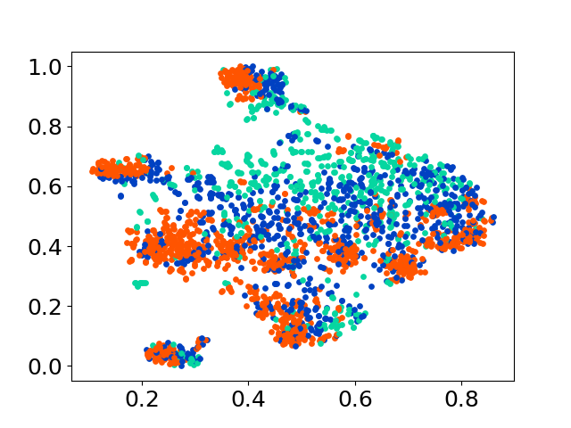
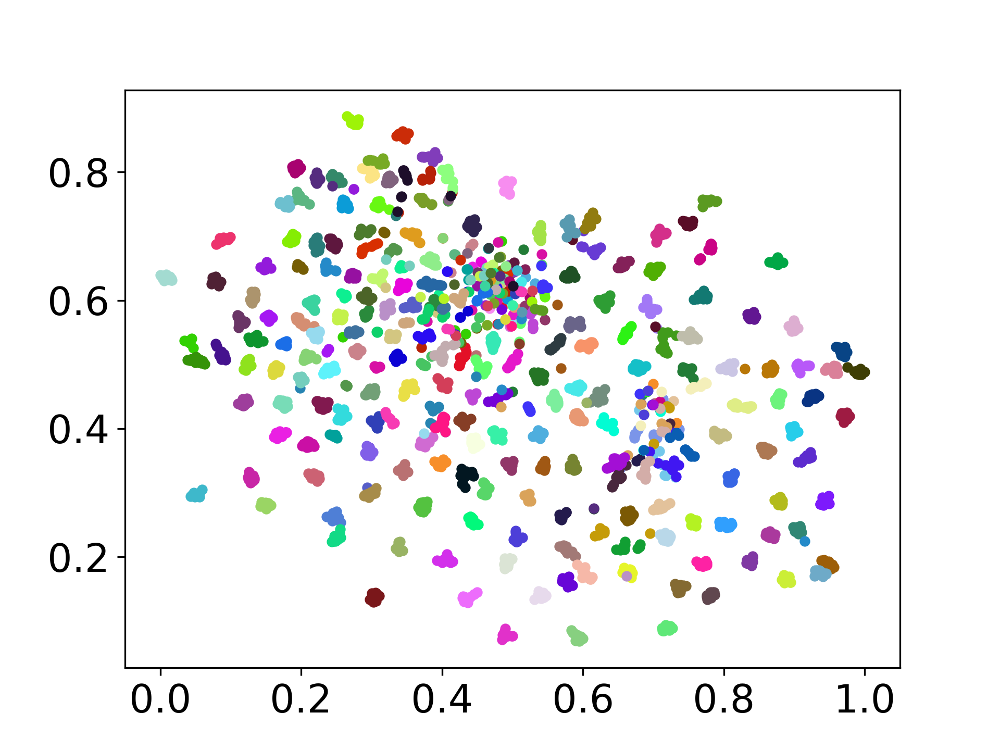
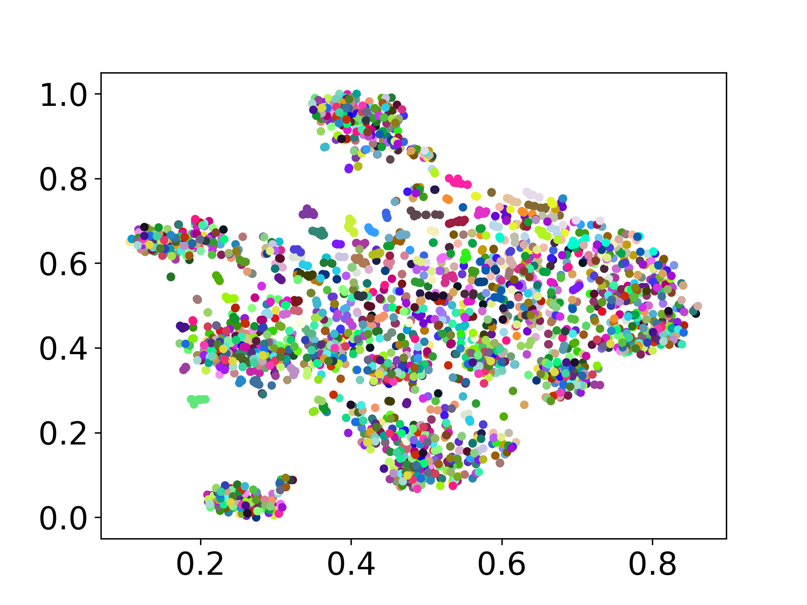

# MINERS : Multilingual Language Models as Semantic Retrievers
 [](https://opensource.org/licenses/Apache-2.0)

Introducing the **MINERS benchmark**, designed to assess the multilingual language models' prowess in semantic retrieval tasks, including bitext mining and classification through retrieval-augmented contexts. A comprehensive framework has been developed to evaluate the effectiveness of language models in retrieving samples across over 200 diverse languages, including low-resource languages in challenging cross-lingual and code-switching settings. The results show that achieving competitive performance with state-of-the-art methods is possible by solely retrieving semantically similar embeddings, without requiring any fine-tuning.


## Paper 
This is the source code of the paper [[Arxiv]]():

This code has been written using PyTorch. If you use any code or datasets from this toolkit in your research, please cite the associated paper.
<pre>
@article{winata2024miners,
  title={MINERS: Multilingual Language Models as Semantic Retrievers},
  author={Winata, Genta Indra and Zhang, Ruochen and Adelani, David Ifeoluwa},
  journal={arXiv preprint arXiv:2109.07684},
  year={2024}
}
</pre>

## Datasets
MINERS comprises **11** datasets: **7** multilingual and **4** code-switching datasets, encompassing both parallel and classification formats. Parallel datasets are suited for bitext retrieval as they contain aligned multilingual content, facilitating bitext mining and machine translation tasks. Additionally, the classification datasets cover intent classification, sentiment analysis, and topic classification, which we assess for retrieval-based and ICL classification assignments.
<p align="center">
  
</p>

## Environment Setup
```
pip install -r requirements.txt
```
If you wish to utilize the APIs or models from OpenAI, Cohere, or Hugging Face, modify the `OPENAI_TOKEN`, `COHERE_TOKEN`, and `HF_TOKEN`. Note that most models on Hugging Face do not require the `HF_TOKEN`, which is specifically intended for the llama and gemma models.

## Experiments Logs
If you wish to get all results and some prompt examples in the experiments, feel free to download them [here](https://drive.google.com/file/d/1yG4VQDClLAhlyGZNxrnByZbOdU2kaAAR/view?usp=drive_link) (~360MB).

## Running Experiments
All experiment results will be stored in the `logs/` directory. You can execute each experiment using the following commands:

### Bitext retrieval
#### Cross-lingual setting
```
❱❱❱ python bitext.py --src_lang {src_lang} --dataset {dataset} --seed {seed} --cuda --model_checkpoint {model_checkpoint}
❱❱❱ python bitext.py --src_lang de --dataset bucc --seed 42 --cuda --model_checkpoint sentence-transformers/LaBSE
```

#### Ensemble
The arguments are similar as above, except we use `--model_checkpoints` and `--weights`
```
❱❱❱ python bitext.py --src_lang {src_lang} --dataset {dataset} --seed {seed} --cuda --model_checkpoint {model_checkpoint}
❱❱❱ python bitext.py --src_lang de --dataset bucc --seed 42 --cuda --model_checkpoint sentence-transformers/LaBSE
```

### Retrieval-based classification
#### Monolingual setting
```
❱❱❱ python classification.py --dataset {dataset} --seed {seed} --cuda --model_checkpoint {model_checkpoint}
❱❱❱ python classification.py --dataset nusax --seed 42 --cuda --model_checkpoint sentence-transformers/LaBSE
```

#### Cross-lingual setting
Add `--src_lang` and `--cross` to the command.
```
❱❱❱ python classification.py --src_lang {src_lang} --cross --dataset {dataset} --seed {seed} --cuda --model_checkpoint {model_checkpoint}
❱❱❱ python classification.py --src_lang eng --cross --dataset nusax --seed 42 --cuda --model_checkpoint sentence-transformers/LaBSE
```

#### Ensemble
The arguments are similar as above, except we use `--model_checkpoints` and `--weights`
```
❱❱❱ python classification.py --dataset {dataset} --seed {seed} --cuda --model_checkpoints {model_checkpoint1} {model_checkpoint2} {...} --weights {weight1} {weight2} {...}
❱❱❱ python classification.py --dataset nusax --seed 42 --cuda --model_checkpoints sentence-transformers/LaBSE intfloat/multilingual-e5-large --weights 0.25 0.75
```

### ICL-based classification
#### Monolingual setting
```
❱❱❱ python icl.py --dataset {dataset} --seed 42 --instruction {instruction} --model_checkpoint {model} --gen_model_checkpoint {gen_model_checkpoint}  --cuda --load_in_8bit --k {k}
❱❱❱ python icl.py --dataset nusax --seed 42 --instruction "Generate a sentiment label for a given input.\nPlease only output the label." --model_checkpoint sentence-transformers/LaBSE --gen_model_checkpoint meta-llama/Meta-Llama-3-8B-Instruct  --cuda --load_in_8bit --k 1
```

#### Cross-lingual setting
Add `--src_lang` and `--cross` to the command.
```
❱❱❱ python icl.py --src_lang {src_lang} --cross --dataset {dataset} --seed 42 --instruction {instruction} --model_checkpoint {model} --gen_model_checkpoint {gen_model_checkpoint}  --cuda --load_in_8bit --k {k}
❱❱❱ python icl.py --src_lang eng --cross --dataset nusax --seed 42 --instruction "Generate a sentiment label for a given input.\nPlease only output the label." --model_checkpoint sentence-transformers/LaBSE --gen_model_checkpoint meta-llama/Meta-Llama-3-8B-Instruct  --cuda --load_in_8bit --k 1
```

## Aggregate experiment results
Add `--k` to modify the number of retrieved samples.
```
❱❱❱ python script/aggregate/aggregate_bitext_mining.py --k {k}
❱❱❱ python script/aggregate/aggregate_classification.py --k {k}
❱❱❱ python script/aggregate/aggregate_classification_cross.py --k {k}
❱❱❱ python script/aggregate/aggregate_icl.py --k {k}
❱❱❱ python script/aggregate/aggregate_icl_cross.py --k {k}
❱❱❱ python script/aggregate/aggregate_icl_percentile.py --k {k}
```

## Visualize the embeddings
```
❱❱❱ python visualize.py --model_checkpoint {model_checkpoint} --dataset {dataset} --seed {seed} --cuda
❱❱❱ python visualize.py --model_checkpoint sentence-transformers/LaBSE --dataset nusax --seed 42 --cuda
```

### Examples of the visualization by class labels: LaBSE (left) and XLM-R BASE (right)
 

### Examples of the visualization by sample ID: LaBSE (left) and XLM-R BASE (right)
 

## Models Support
Our codebase supports the usage of multiple models for the experiments, providing flexibility for customization beyond the list shown below:
### Encoder LMs and APIs
#### Open-source LMs:
- LaBSE
- CMLM
- multilingual E5 BASE
- multilingual E5 LARGE
- multilingual MPNet BASE
- multilingual MiniLM L12-E384
- Glot-500
- XLM-R BASE
- XLM-R LARGE

#### Commercial embedding APIs (last tested as of June 2024)
- Cohere-Embedv3
- OpenAI-Embedv3

### Generative LMs:
- BLOOMZ
- mT0
- XGLM
- Aya-23
- Aya-101
- Gemma 1.1 Instruct
- Llama 3 8B
- GPT models  (last tested as of June 2024)
- Cohere Command R  (last tested as of June 2024)
